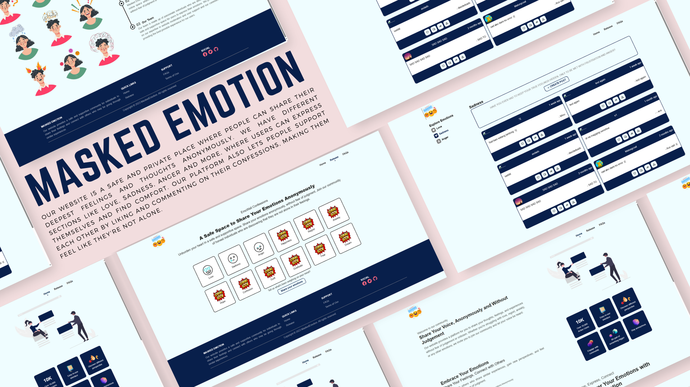

# EmoWall

Our website is a safe and private place where people can share their deepest feelings and thoughts anonymously. We have different sections like love, sadness, anger and more, where users can express themselves and find comfort. Our platform also lets people support each other by liking and commenting on their confessions, making them feel like they're not alone.

Check out the backend of [MaskedEmotion](https://github.com/lugh-tuatha/MaskedEmotion-Backend)

## Roadmap

- [ ] Make user friendliness
    - [ ] Add more validation
    - [ ] Provide clearer instructions
- [ ] Enhance Functionality
    - [ ] Ensure that "react," "comment," "share," and "report" features work properly.
- [ ] feature
    - [ ] Add darkmode function
- [ ] pages
    - [x] Add faqs
    - [ ] Anonymous message similar with ngl
    - [ ] Our team page
- [x] host a cloud that can upload image

## 3.0 Roadmap
- [ ] Feature
    - [ ] Can share anonymous link similar to ngl
    - [ ] Will be having user signup / login
- [ ] New pages for profile

## Release History
* 2.0.1
    * Avatar will go directly to cloudinary
    * 
* 2.0.0
    * Removed log-in and sign-up features
    * Redesigned user interface
    * Changed the CSS framework from Bootstrap to Tailwind
* 1.0.0
    * The first proper release
* 0.1.0
    * Work in progress

## Built With
 
 
 
 
 

## Acknowledgments
I want to acknowledge the valuable contributions of these resources in the development of our project.
* [react-time-ago](https://www.npmjs.com/package/react-time-ago)
* [sweetalert2](https://sweetalert2.github.io/)
* [react-router-dom](https://www.npmjs.com/package/react-router-dom)
* [react-icons](https://react-icons.github.io/react-icons)
* [axios](https://www.npmjs.com/package/axios)
* [jsonwebtoken](https://www.npmjs.com/package/jsonwebtoken)
* [react-collapse](https://www.npmjs.com/package/react-collapse)
